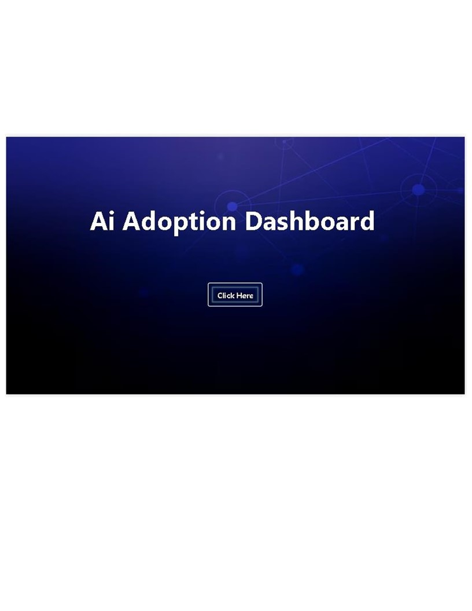
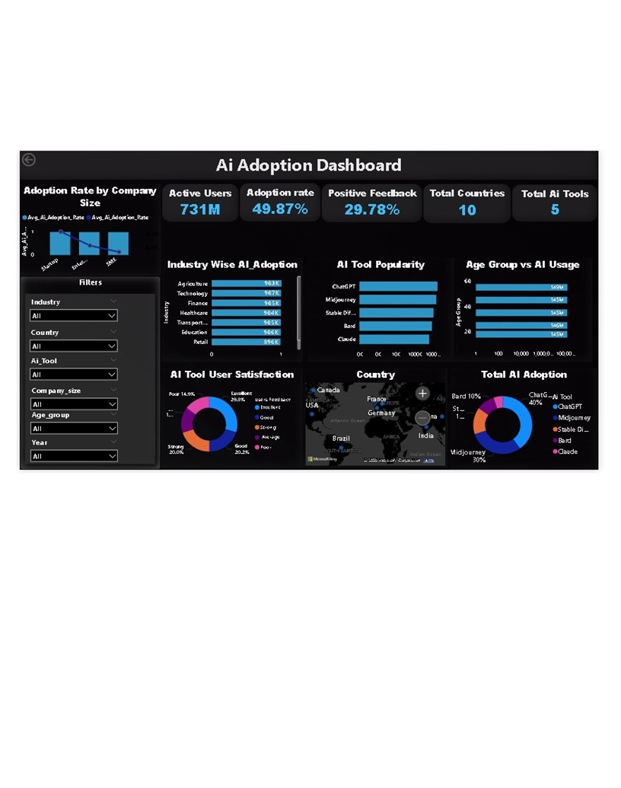

# 🤖 AI Adoption Dashboard (Power BI)

## 📌 Project Overview
This project presents an interactive Power BI dashboard analyzing AI adoption across industries, countries, and user segments.

The dashboard provides insights into:
- AI adoption trends
- Popular AI tools
- User engagement
- Industry-wise AI usage
- Customer feedback analysis

---

## 📊 Key Features
- KPI Cards (Active Users, Adoption Rate, Feedback %)
- Industry-wise AI Adoption Analysis
- AI Tool Popularity
- Age Group vs AI Usage
- Country-wise AI Distribution (Map)
- User Feedback Analysis

---

## 🛠 Tools & Technologies
- Power BI
- DAX (Data Analysis Expressions)
- Excel (Data Source)

---

## 📈 Key Insights
- AI adoption is highest in the Technology and Finance sectors
- ChatGPT and Midjourney are among the most used AI tools
- Majority of users fall under the 25–44 age group
- Positive feedback rate is ~30%

---

## 📂 Files Included
- `AI_Adoption_Dashboard.pbix` → Power BI dashboard
- `AI_Adoption_Dataset.xlsx` → Dataset used
- `dashboard.png` → Dashboard preview

---

## 📷 Dashboard Preview

---

## 🚀 Author
Ritesh Kashyap
